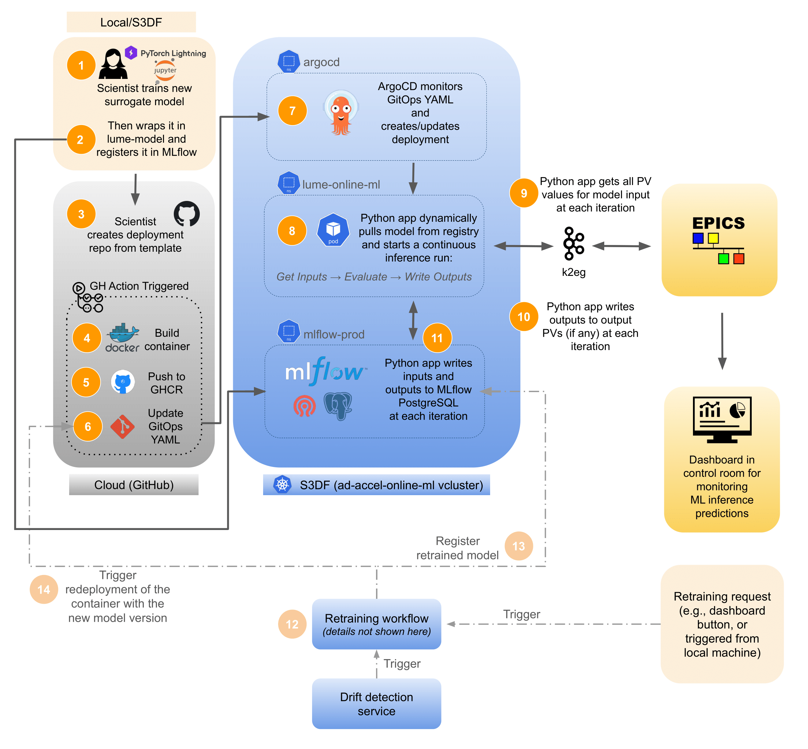

# LUME-Model Deployment Template

> [!CAUTION]
> This template is under active development and may change. Please report any issues or suggestions.

This repository provides a [copier](https://copier.readthedocs.io/) template for deploying machine learning models 
using [LUME-Model](https://github.com/slaclab/lume-model) in an online environment. It offers a structured, 
reproducible approach to containerizing and deploying ML models, ensuring consistency and ease of use across different
projects, and reducing the overhead of writing boilerplate code for deployment.

It was developed for use at SLAC National Accelerator Laboratory, particularly for deploying models on the S3DF
Kubernetes cluster, but can be adapted for other environments. It supports continuous inference using inputs from EPICS
PVs, and optionally writing outputs back to EPICS PVs. It also supports MLflow for model versioning and tracking.

<div align="center">
  
</div>

> [!IMPORTANT]  
> Before creating a deployment project using this template, please ensure that:
> * your model is logged in [mlflow](https://mlflow.org/) and is versioned and tagged appropriately
> * your model is trained and has the appropriate transformations to work with raw machine data through LUME-model
> * you want to deploy your model on an S3DF Kubernetes cluster where it will continuously run inference using
inputs from EPICS PVs, and optionally write outputs back to EPICS PVs

---

## Use Cases
- **Accelerator controls**: Deploy ML models for online inference in accelerator control systems.
- **Rapid prototyping**: Quickly scaffold new model deployment projects with best practices.
- **Consistent deployment**: Standardize deployment across teams and projects.

---

## Getting Started

### Prerequisites
- [Python 3.10+](https://www.python.org/)
- [copier](https://copier.readthedocs.io/en/stable/) (`pip install copier`)

### Installation
Install copier if you haven't already:
```bash
pip install copier
```

### Before Creating a Deployment Project
You need to register your model in MLflow and prepare the PV mapping for your deployment.


#### Register the model
Assuming you have a trained model wrapped in a LUME model class (e.g., `TorchModel`, etc.), you can register it to MLflow as shown
below. 

Note that: 
- **you must edit the metadata section for your specific model**
- **you must have MLflow installed**
- **you must be on the SLAC network to register to the SLAC MLflow registry**

```python
import mlflow
from lume_model.models import TorchModel

# load model from yaml
model = TorchModel("model_config.yaml")

## Editable Configuration 
MLFLOW_URI = "https://ard-mlflow.slac.stanford.edu"
EXPERIMENT_NAME = "lume-example-deployment"

# Set MLflow tracking
mlflow.set_tracking_uri(MLFLOW_URI)
mlflow.set_experiment(EXPERIMENT_NAME)

# Metadata - EDIT FOR EACH MODEL
# Only use lowercase alphanumeric characters and hyphens!
REGISTERED_MODEL_NAME = "lume-example-model"  

EMAIL = "user@slac.stanford.edu"
REPO = "https://github.com/slaclab/lume-example-model"
BEAM_PATH = "cu_hxr"
DESCRIPTION = "Example model"
READY_TO_DEPLOY = "true"  # Set to "true" for production (sends to controls servers), "false" for dev
STAGE = "production"  # development, staging, or production

# Set tags
model_tags = {
    "email": EMAIL,
    "repo": REPO,
    "beam_path": BEAM_PATH,
    "description": DESCRIPTION,
    "stage": STAGE,
}

version_tags = {
    "ready_to_deploy": READY_TO_DEPLOY,
}

# Register model
model.register_to_mlflow(
    artifact_path="model",
    registered_model_name=REGISTERED_MODEL_NAME,
    tags=model_tags,
    version_tags=version_tags
)
```

#### Generate PV Mapping

You need to create a file called `pv_mapping.yaml` that defines how the control parameters map to the model's input and
output features. This file will later be copied into the template project.

The structure of the `pv_mapping.yaml` file should look like this example:

```yaml
input_variables:
  model_input_1:
    symbols:
      - INPUT:PV:1
      - INPUT:PV:2
    formula: (INPUT:PV:1**2 + INPUT:PV:2**2)**(1/2)
    proto: ca
  model_input_2:
    formula: "1.850"  # constant value needs to match lume-model config exactly
  model_input_3:
    symbols:
      - INPUT:PV:3
    formula: INPUT:PV:3
    proto: ca
    ...
output_variables:
  OUTPUT:PV:1:
    symbols: 
      - model_output_1
    formula: model_output_1 * 2.0 + 1.0
    proto: pva
    ...
```

Note that constants must be set correctly in your config; mismatches may cause validation errors.

> [!IMPORTANT]  
> There is currently no validation implemented for this; user must ensure config matches the LUME-model and that the mapping
is defined correctly.

---

#### Deploy inference service 
The ML model is now separate from this deployment and runs in its own inference service.
To get the url of the inference service to put in the template, log into the vcluster and run 

```
kubectl get svc -n lume-online-ml
```
The inference service url for the model should be ready before generating the template and it should be deployed in the same namespace. 
If the inference service is not available, follow the instructions [here](https://github.com/slaclab/inference-service/tree/main).

## Using the Template
First make sure `copier` is installed in your Python environment.
To generate a new deployment project, create a new folder for the project. We recommend giving your 
directory/repository a meaningful name related to your deployment, such as `lume-example-deployment`. Then run:
```bash
copier copy gh:slaclab/lume-model-deployment-template <destination-folder>
```
You will be prompted for configuration values (e.g., deployment name, model version, etc.). You should have the
following information ready:
- **registered_model_name**: Name of the model as registered in the MLflow Model Registry. This should be something 
like `xcs-nn-surrogate` or `lcls-cu-inj-model`, using all lowercase letters, numbers and hyphens.
- **model_version**: Version of the model as registered in the MLflow Model Registry. This should be an integer, e.g., `1`.
- **deployment_name**: Name of the Kubernetes deployment. This must be unique within the Kubernetes namespace you are deploying to.
It should be something like `xcs-nn-surrogate-deployment` or `lcls-cu-inj-model-deployment`, using all lowercase letters, numbers and hyphens.
**Note that all deployments will be in the same namespace, `lume-online-ml`, so choose unique names.**
- **rate**: Inference rate in Hz. This is how often the model will run inference. Default is `1` (once per second).
- **mlflow_tracking_uri**: The MLflow tracking server URI. This can be either the production server or a local server for testing.
- **interface**: The interface to use for EPICS PV access. This should be either `epics` (ChannelAccess only), `k2eg` (can define protocol), or `test`.
- **device**: Whether to use `cpu` or `gpu` for model inference. Default is `cpu`.

### Updating an Existing Deployment
If the template is updated and you want to apply changes to your project:
```bash
copier update
```
This will re-apply the template, preserving your answers and customizations where possible.

---

## Project Structure
Main project files:
- `README.md` — This file with instructions and information about the deployment
- `src/online_model` — Source code for deployment logic and interfaces
- `config/` — Directory containing the configuration files for k2eg (injected into pod at runtime)
- `Dockerfile.jinja` — Jinja-templated Dockerfile for containerization
- `pyproject.toml` — Python dependencies
- `deployment.yaml` — Jinja-templated deployment configuration

---

# Deploying After Generating Your Project

1. Navigate to your new project directory:
   ```bash
   cd <destination-folder>
   ```
2. Review and customize the generated files as needed. You need to add `pv_mapping.yaml` file in the `src/online_model/configs/` directory
   to map input and output PVs to model features. Refer to the `README.md` in your generated project for details on how to set this up.
**Note that it is not recommended to change the template or source code to avoid complications when updating the template in the future,
and to ensure consistency across deployments.**
3. Test your deployment locally or in your target environment following the instructions in the generated `README.md`.
4. Once satisfied, push your project to GitHub under `slaclab` (recommended for S3DF deployments). We recommend giving your 
directory/repository a meaningful name related to your deployment, such as `snd-nn-model-deployment` or `lcls-cu-inj-model-deployment`.
5. A GitHub Actions workflow is already configured for your repository. It will build and push your Docker image to 
the GitHub Container Register under `slaclab` upon pushing to the `main` branch, and update the deployment file with the 
latest image tag.
6. For the initial deployment, you will need someone with access to the Kubernetes cluster to help set up the initial deployment 
if you don't have vcluster access yet. Once your project repo is set up, create a new issue in your repo and tag the team for assistance.
7. After the initial setup, you can obtain vcluster access and manage and update your deployment using `kubectl` commands.
8. Update the deployment as needed using `copier update`. 


Don't forget to document any customizations or changes made to the template, and share feedback or contribute 
improvements to the template repository!

---
# Development Roadmap

## 1-2 months
- [X] Add support for pre-model-evaluation PV transformations (e.g., formulas)
- [ ] Add support for local model loading for models that are not in MLflow
- [X] (Mostly done) Expand docs (how to upload models to MLflow and versioning/tagging requirements, how to set up MLflow locally 
for testing, how to set up vcluster access, etc)
- [X] Tutorial + demo for 1-2 use cases

## 2-4 months
- [ ] Add templated way of adding requirements from the user at project generation
- [X] Add support for writing outputs back to EPICS PVs
- [X] Add support for automated deployment to S3DF Kubernetes (tentative)
- [ ] Add support for gpu-based models
